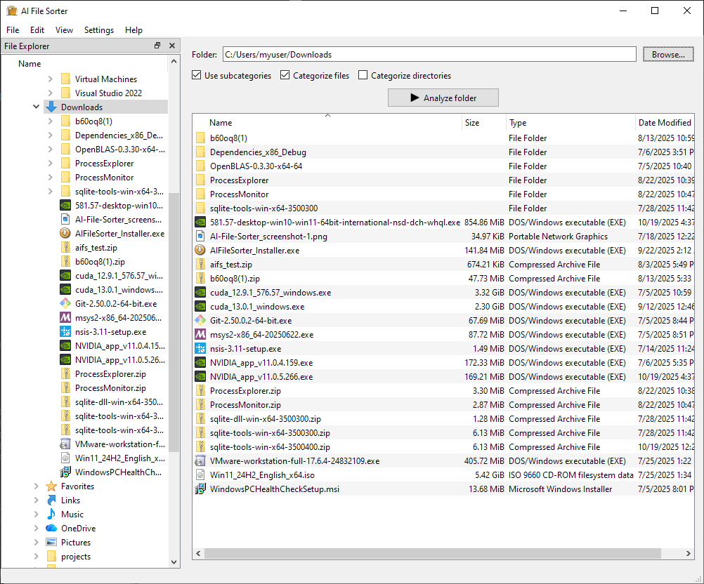
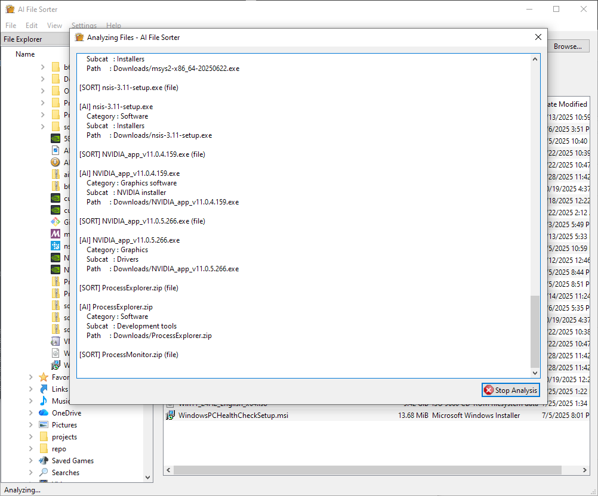
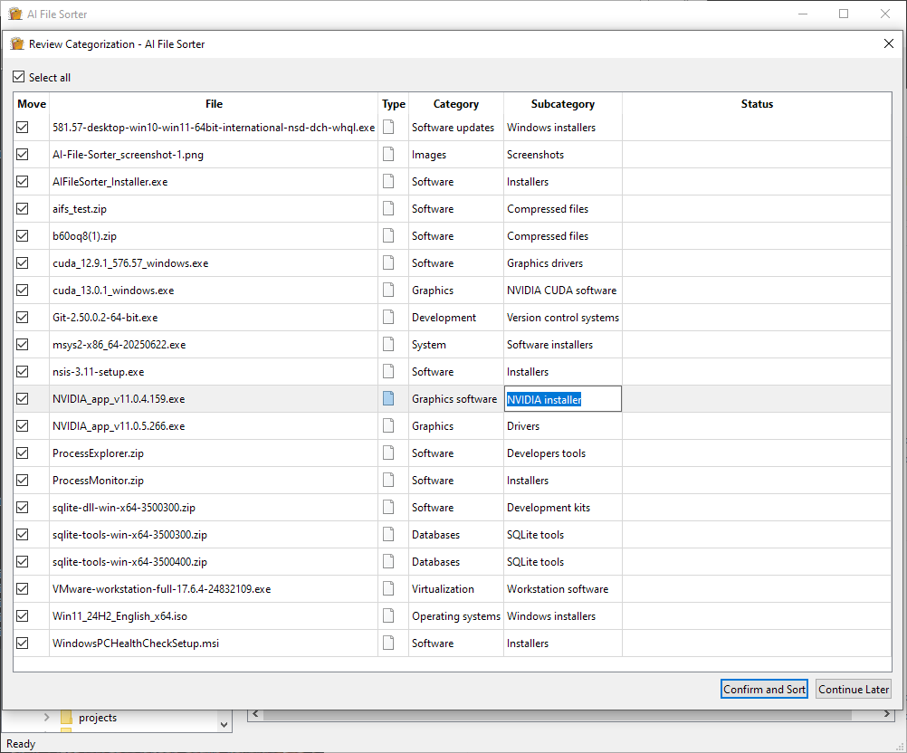
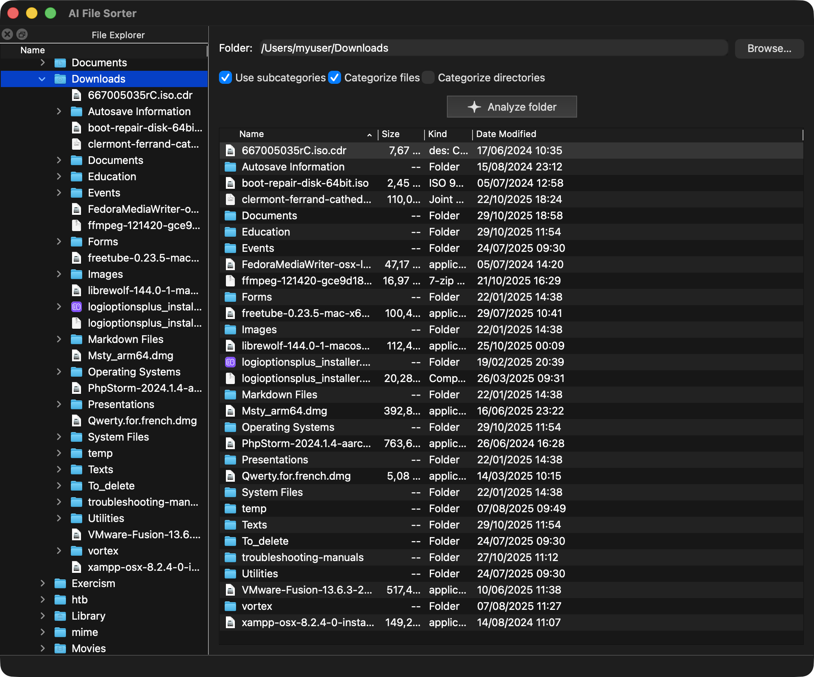
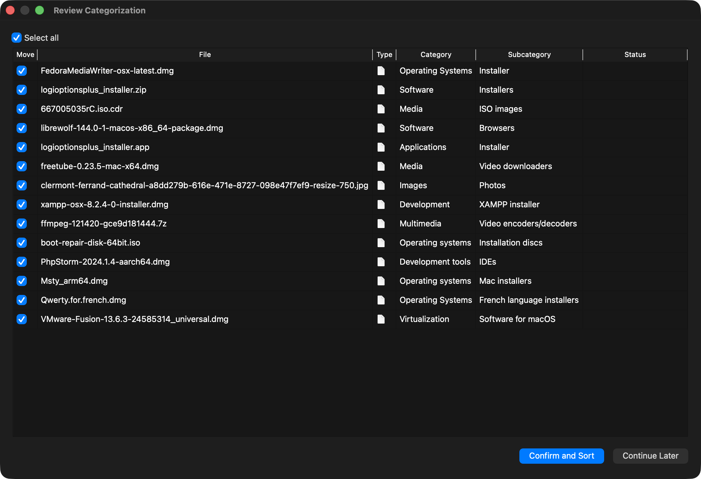

<!-- markdownlint-disable MD046 -->
# AI File Sorter

[](#)

AI File Sorter is a powerful, cross-platform desktop application that automates file organization with the help of AI.  

It helps tidy up cluttered folders like Downloads, external drives, or NAS storage by automatically categorizing files based on their names, extensions, directory context, and taxonomy.  

It uses a **taxonomy-based system**, so the more files you sort, the more consistent and accurate the categories become over time. It essentially builds up a smarter internal reference for your file types and naming patterns. File content–based sorting for certain file types is also in development.  

The app intelligently assigns categories and optional subcategories, which you can review and adjust before confirming. Once approved, the necessary folders are created and your files are sorted automatically.  

AI File Sorter runs **local large language models (LLMs)** such as *LLaMa 3B* and *Mistral 7B*, and does not require an internet connection unless you choose to use a remote model.

---

#### How It Works

1. Point it at a folder or drive  
2. It runs a local LLM to analyze your files  
3. The LLM suggests categorizations  
4. You review and adjust if needed — done  

---

[](https://sourceforge.net/projects/ai-file-sorter/files/latest/download)

    

---

- [AI File Sorter](#ai-file-sorter)
  - [Changelog](#changelog)
    - [[1.0.0] - 2025-10-30](#100---2025-10-30)
    - [[0.9.7] - 2025-10-19](#097---2025-10-19)
    - [[0.9.3] - 2025-09-22](#093---2025-09-22)
    - [[0.9.2] - 2025-08-06](#092---2025-08-06)
    - [[0.9.1] - 2025-08-01](#091---2025-08-01)
    - [[0.9.0] - 2025-07-18](#090---2025-07-18)
  - [Features](#features)
  - [Requirements](#requirements)
  - [Installation](#installation)
    - [Linux](#linux)
    - [macOS](#macos)
    - [Windows](#windows)
  - [Uninstallation](#uninstallation)
  - [API Key, Obfuscation, and Encryption](#api-key-obfuscation-and-encryption)
  - [How to Use](#how-to-use)
  - [Sorting a Remote Directory (e.g., NAS)](#sorting-a-remote-directory-eg-nas)
  - [Contributing](#contributing)
  - [Credits](#credits)
  - [License](#license)
  - [Donation](#donation)

---

## Changelog

### [1.0.0] - 2025-10-30

- Migrated the entire desktop UI from GTK/Glade to a native Qt6 interface.
- Added selection boxes for files in the categorization review dialog.
- Added internatioinalization framework and the French translation for the user interface.
- Added refreshed menu icons, mnemonic behaviour, and persistent File Explorer settings.
- Simplified cross-platform builds (Linux/macOS) around Qt6; retired the MSYS2/GTK toolchain.
- Optimized and cleaned up the code. Fixed error-prone areas.
- Modernized the build pipeline. Introduced CMake for compilation on Windows.

### [0.9.7] - 2025-10-19

- Added paths to files in LLM requests for more context.
- Added taxonomy for more consistent assignment of categories across categorizations.
  (Narrowing down the number of categories and subcategories).
- Improved the readability of the categorization progress dialog box.
- Improved the stability of CUDA detection and interaction.
- Added more logging coverage throughout the code base.

### [0.9.3] - 2025-09-22

- Added compatibility with CUDA 13.

### [0.9.2] - 2025-08-06

- Bug fixes.
- Increased code coverage with logging.

### [0.9.1] - 2025-08-01

- Bug fixes.
- Minor improvements for stability.
- Removed the deprecated GPU backend from the runtime build.

### [0.9.0] - 2025-07-18

- Local LLM support with `llama.cpp`.
- LLM selection and download dialog.
- Improved `Makefile` for a more hassle-free build and installation.
- Minor bug fixes and improvements.

---

## Features

- **AI-Powered Categorization**: Classify files intelligently using either a **local LLM** (LLaMa, Mistral) or a
                                 remote LLM (ChatGPT), depending on your preference.
- **Offline-Friendly**: Use a local LLM to categorize files entirely - no internet or API key required.
  **Customizable Sorting Rules**: Automatically assign categories and subcategories for granular organization.
- **Qt6 Interface**: Lightweight and responsive UI with refreshed menus and icons.
- **Cross-Platform Compatibility**: Works on Windows, macOS, and Linux.
- **Local Database Caching**: Speeds up repeated categorization and minimizes remote LLM usage costs.
- **Sorting Preview**: See how files will be organized before confirming changes.
- **Secure API Key Encryption**: When using the remote model, your API key is stored securely with encryption.
- **Update Notifications**: Get notified about updates - with optional or required update flows.

---

## Requirements

- **Operating System**: Linux or macOS for source builds (Windows builds are provided as binaries; native Qt/MSVC build instructions are planned).
- **Compiler**: A C++20-capable compiler (`g++` or `clang++`).
- **Qt 6**: Core, Gui, Widgets modules and the Qt resource compiler (`qt6-base-dev` / `qt6-tools` on Linux, `brew install qt` on macOS).
- **Libraries**: `curl`, `sqlite3`, `fmt`, `spdlog`, and the prebuilt `llama` libraries shipped under `app/lib/precompiled`.
- **Git** (optional): For cloning this repository. Archives can also be downloaded.
- **OpenAI API Key** (optional): Required only when using the remote ChatGPT workflow.

---

## Installation

File categorization with local LLMs is completely free of charge. If you prefer to use the ChatGPT workflow you will need an OpenAI API key with a small balance (see [API Key, Obfuscation, and Encryption](#api-key-obfuscation-and-encryption)).

### Linux

#### Prebuilt Debian/Ubuntu package

1. **Install runtime prerequisites** (Qt6, networking, database, math libraries):
   ```bash
   sudo apt update && sudo apt install -y \
     libqt6widgets6 libcurl4 libjsoncpp25 libfmt9 libopenblas0-pthread
   ```
   Ensure that the Qt platform plugins are installed (on Ubuntu 22.04 this is provided by `qt6-wayland`).
   GPU acceleration additionally requires an NVIDIA driver with the matching CUDA runtime (`nvidia-cuda-toolkit` or the vendor packages).
2. **Install the package**
   ```bash
   sudo apt install ./aifilesorter_1.0.0_amd64.deb
   ```
   Using `apt install` (rather than `dpkg -i`) ensures any missing dependencies listed above are installed automatically.

#### Build from source

1. **Install dependencies**
   - Debian / Ubuntu:
     ```bash
     sudo apt update && sudo apt install -y \\
       build-essential cmake git qt6-base-dev qt6-base-dev-tools qt6-tools-dev-tools \\
       libcurl4-openssl-dev libjsoncpp-dev libsqlite3-dev libssl-dev libfmt-dev libspdlog-dev
     ```
   - Fedora / RHEL:
     ```bash
     sudo dnf install -y gcc-c++ cmake git qt6-qtbase-devel qt6-qttools-devel \\
       libcurl-devel jsoncpp-devel sqlite-devel openssl-devel fmt-devel spdlog-devel
     ```
   - Arch / Manjaro:
     ```bash
     sudo pacman -S --needed base-devel git cmake qt6-base qt6-tools curl jsoncpp sqlite openssl fmt spdlog
     ```
     Optional CUDA support also requires the distro CUDA packages.
2. **Clone the repository**
   ```bash
   git clone https://github.com/hyperfield/ai-file-sorter.git
   cd ai-file-sorter
   git submodule update --init --recursive --remote
   ```
3. **Build the llama runtime** (add `cuda=on` if you have a CUDA toolchain)
   ```bash
   ./app/scripts/build_llama_linux.sh [cuda=on|cuda=off]
   ```
4. **Compile the application**
   ```bash
   cd app
   make -j4
   ```
   The binary is produced at `app/bin/aifilesorter`.
5. **Install system-wide (optional)**
   ```bash
   sudo make install
   ```

### macOS

1. **Install Xcode command-line tools** (`xcode-select --install`).
2. **Install Homebrew** (if required).
3. **Install dependencies**
   ```bash
   brew install qt curl jsoncpp sqlite openssl fmt spdlog cmake git
   ```
   Add Qt to your environment if it is not already present:
   ```bash
   export PATH="$(brew --prefix)/opt/qt/bin:$PATH"
   export PKG_CONFIG_PATH="$(brew --prefix)/lib/pkgconfig:$(brew --prefix)/share/pkgconfig:$PKG_CONFIG_PATH"
   ```
4. **Clone the repository and submodules** (same commands as Linux).
5. **Build the llama runtime**
   ```bash
   ./app/scripts/build_llama_macos.sh
   ```
6. **Compile the application**
   ```bash
   cd app
   make -j4
   sudo make install   # optional
   ```

### Windows

Build now targets native MSVC + Qt6 without MSYS2. Two options are supported; the vcpkg route is simplest.

Option A - CMake + vcpkg (recommended)

1. Install prerequisites:
   - Visual Studio 2022 with Desktop C++ workload
   - CMake 3.21+ (Visual Studio ships a recent version)
   - vcpkg: <https://github.com/microsoft/vcpkg> (clone and bootstrap)
2. Clone repo and submodules:
   ```powershell
   git clone https://github.com/hyperfield/ai-file-sorter.git
   cd ai-file-sorter
   git submodule update --init --recursive
   ```
3. Determine your vcpkg root. It is the folder that contains `vcpkg.exe` (for example `C:\dev\vcpkg`).
    - If `vcpkg` is on your `PATH`, run this command to print the location:
      ```powershell
      Split-Path -Parent (Get-Command vcpkg).Source
      ```
    - Otherwise use the directory where you cloned vcpkg.
4. Build the bundled `llama.cpp` runtime (run from the same **x64 Native Tools** / **VS 2022 Developer PowerShell** shell). Pass `cuda=on` if you have a CUDA toolkit configured, otherwise leave it off (default is CPU-only):
   ```powershell
   app\scripts\build_llama_windows.ps1 [cuda=on|off] [vcpkgroot=C:\dev\vcpkg]
   ```
   This script produces the `llama.dll`/`ggml*.dll` set under `app\lib\precompiled` which the GUI links against.
5. Build the Qt6 application using the helper script (still in the VS shell). The helper stages runtime DLLs via `windeployqt`, so `app\build-windows\Release` is immediately runnable:
   ```powershell
   # One-time per shell if script execution is blocked:
   Set-ExecutionPolicy -Scope Process -ExecutionPolicy Bypass

   app\build_windows.ps1 -Configuration Release -VcpkgRoot C:\dev\vcpkg
   ```
   - Replace `C:\dev\vcpkg` with the path where you cloned vcpkg; it must contain `scripts\buildsystems\vcpkg.cmake`.
   - `-VcpkgRoot` is optional if `VCPKG_ROOT`/`VPKG_ROOT` is set or `vcpkg`/`vpkg` is on `PATH`.
   - The executable and required Qt/third-party DLLs are placed in `app\build-windows\Release`. Pass `-SkipDeploy` if you only want the binaries without bundling runtime DLLs.

Option B - CMake + Qt online installer

1. Install prerequisites:
   - Visual Studio 2022 with Desktop C++ workload
   - Qt 6.x MSVC kit via Qt Online Installer (e.g., Qt 6.6+ with MSVC 2019/2022)
   - CMake 3.21+
   - vcpkg (for non-Qt libs): curl, jsoncpp, sqlite3, openssl, fmt, spdlog, gettext
2. Build the bundled `llama.cpp` runtime (same VS shell). Any missing OpenBLAS/cURL packages are installed automatically via vcpkg:
   ```powershell
   pwsh .\app\scripts\build_llama_windows.ps1 [cuda=on|off] [vcpkgroot=C:\dev\vcpkg]
   ```
   This is required before configuring the GUI because the build links against the produced `llama` static libraries/DLLs.
3. Configure CMake to see Qt (adapt `CMAKE_PREFIX_PATH` to your Qt install):
    ```powershell
    $env:VCPKG_ROOT = "C:\path\to\vcpkg" (e.g., `C:\dev\vcpkg`)
    $qt = "C:\Qt\6.6.3\msvc2019_64"  # example
    cmake -S app -B build -G "Ninja" `
      -DCMAKE_PREFIX_PATH=$qt `
     -DCMAKE_TOOLCHAIN_FILE=$env:VCPKG_ROOT\scripts\buildsystems\vcpkg.cmake `
     -DVCPKG_TARGET_TRIPLET=x64-windows
   cmake --build build --config Release
   ```

Notes
- To rebuild from scratch, run `.\app\build_windows.ps1 -Clean`. The script removes the local `app\build-windows` directory before configuring.
- Runtime DLLs are copied automatically via `windeployqt` after each successful build; skip this step with `-SkipDeploy` if you manage deployment yourself.
- If Visual Studio sets `VCPKG_ROOT` to its bundled copy under `Program Files`, clone vcpkg to a writable directory (for example `C:\dev\vcpkg`) and pass `vcpkgroot=<path>` when running `build_llama_windows.ps1`.
- If you enable CUDA for local models, build `llama.cpp` with CUDA first and reconfigure CMake accordingly.

---

## Uninstallation

- **Linux**: `cd app && sudo make uninstall`
- **macOS**: `cd app && sudo make uninstall`

The command removes the executable and the staged precompiled libraries. You can also delete cached local LLM models in `~/.local/share/aifilesorter/llms` (Linux) or `~/Library/Application Support/aifilesorter/llms` (macOS) if you no longer need them.

---

## API Key, Obfuscation, and Encryption

**Important**: This step is needed *only* if you are going to use the Remote LLM option.

Before compiling the app:

1. Get an OpenAI API key from the [OpenAI website](https://platform.openai.com/).  
   A minimal balance is required in your OpenAI API account for the app to function.

2. Generate a 32-character random secret key, e.g., using [this tool](https://passwords-generator.org/32-character).

    **Important**: If you're compiling on Windows, make sure there is NO `=` in the generated key! If one or more `=` are there, regenerate the key!
    **Important**: If you're compiling on Windows, it's probably best to avoid symbols due to possible unpredictable parsing issues.

    Your secret key could look something like `sVPV2fWoRg5q62AuCGVQ4p0NbHIU5DEv` or `du)]--Wg#+Au89Ro6eRMJc"]qx~owL_X`.

3. Navigate to the `api-key-encryption` folder, then make a file named `encryption.ini` with the following content:

    ```ini
    LLM_API_KEY=sk-...
    SECRET_KEY=your-generated-32-byte-secret-key
    ```

4. Run the `compile.sh` (or `compile_mac.sh`) script in the same directory to generate the executable `obfuscate_encrypt`.
 due 
5. Execute `obfuscate_encrypt` to generate:
   - Obfuscated Key part 1
   - Obfuscated Key part 2
   - Encrypted data (hex)

6. Update the application files:
   - Update `app/include/CryptoManager.hpp` with Obfuscated Key part 1:

     ```cpp
     static constexpr char embedded_pc[] = "insert-obfuscated-Key-part-1-here";
     ```

   - Add the values to `app/resources/.env` as shown:

     ```ini
     ENV_PC=obfuscated-key-part2-value
     ENV_RR=encrypted-data-hex-value
     ```

7. Continue with [Installation](#installation)

---

## Uninstallation

In the same subdirectory `app`, run `sudo make uninstall`.

---

## How to Use

1. Launch the application (see the last step in [Installation](#installation) according your OS).
2. Select a directory to analyze.
3. Tick off the checkboxes on the main window according to your preferences.
4. Click the **"Analyze"** button. The app will scan each file and/or directory based on your selected options.
5. A review dialog will appear. Verify the assigned categories (and subcategories, if enabled in step 3).
6. Click **"Confirm & Sort!"** to move the files, or **"Continue Later"** to postpone. You can always resume where you left off since categorization results are saved.

---

## Sorting a Remote Directory (e.g., NAS)

Follow the steps in [How to Use](#how-to-use), but modify **step 2** as follows:  

- **Windows:** Assign a drive letter (e.g., `Z:` or `X:`) to your network share ([instructions here](https://support.microsoft.com/en-us/windows/map-a-network-drive-in-windows-29ce55d1-34e3-a7e2-4801-131475f9557d)).  
- **Linux & macOS:** Mount the network share to a local folder using a command like:  

  ```sh
  sudo mount -t cifs //192.168.1.100/shared_folder /mnt/nas -o username=myuser,password=mypass,uid=$(id -u),gid=$(id -g)
  ```

(Replace 192.168.1.100/shared_folder with your actual network location path and adjust options as needed.)

---

## Contributing

- Fork the repository and submit pull requests.
- Report issues or suggest features on the GitHub issue tracker.
- Follow the existing code style and documentation format.

---

## Credits

- Curl: <https://github.com/curl/curl>
- Dotenv: <https://github.com/motdotla/dotenv>
- git-scm: <https://git-scm.com>
- Hugging Face: <https://huggingface.co>
- JSONCPP: <https://github.com/open-source-parsers/jsoncpp>
- LLaMa: <https://www.llama.com>
- llama.cpp <https://github.com/ggml-org/llama.cpp>
- Mistral AI: <https://mistral.ai>
- OpenAI: <https://platform.openai.com/docs/overview>
- OpenSSL: <https://github.com/openssl/openssl>
- Qt: <https://www.qt.io/>
- spdlog: <https://github.com/gabime/spdlog>

## License

This project is licensed under the GNU AFFERO GENERAL PUBLIC LICENSE (GNU AGPL). See the [LICENSE](LICENSE) file for details.

---

## Donation

Support the development of **AI File Sorter** and its future features. Every contribution counts!

- **[Donate via PayPal](https://paypal.me/aifilesorter)**
- **Bitcoin**: 12H8VvRG9PGyHoBzbYxVGcu8PaLL6pc3NM
- **Ethereum**: 0x09c6918160e2AA2b57BfD40BCF2A4BD61B38B2F9
- **Tron**: TGPr8b5RxC5JEaZXkzeGVxq7hExEAi7Yaj

USDT is also accepted in Ethereum and Tron chains.

---
